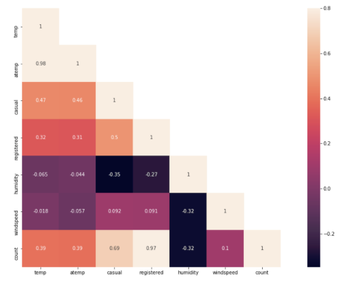
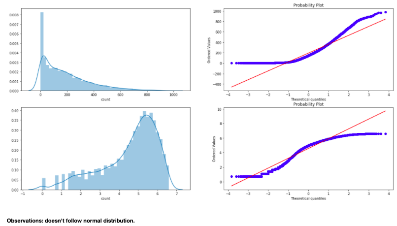
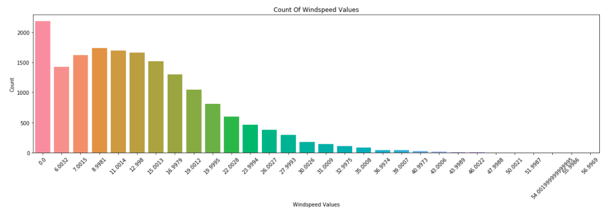
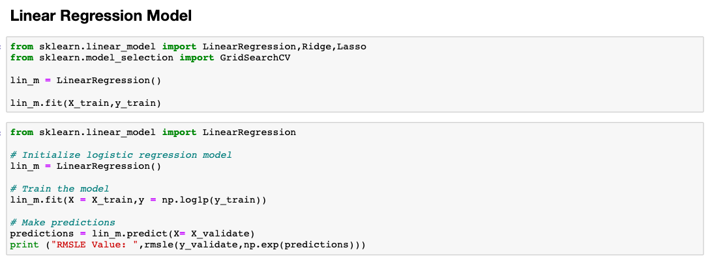
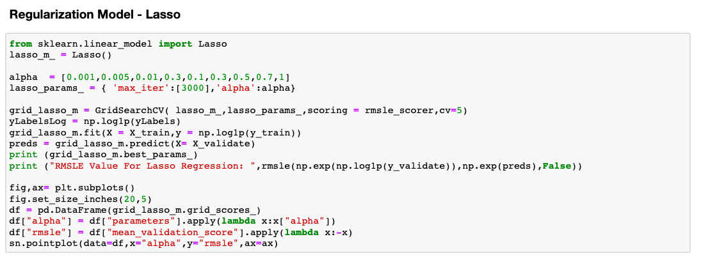
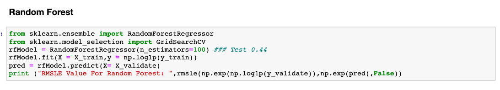
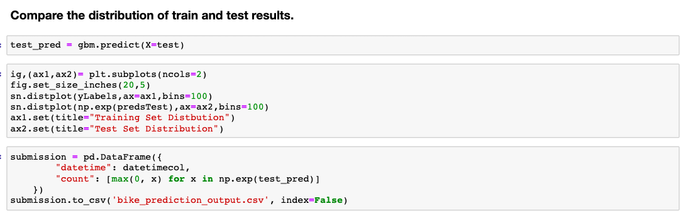

# Forecasting Bikeshare Demand 

## Introduction
Capital Bikeshare is a DC-based bike sharing business. This dataset contains various weather and time conditions and is used to predict overall demand. 

## Data Exploration

Exploratory analysis will tell us how many bicycles are expected to be checked out during any given time of the day. 

Some questions explored are: 
Which factors contribute most to the number of bicycles being checked out over the course of a given day? 
How much of an impact does weather have on demand? 
How does the behavior of casual users differ from subscribers? 

### Outlier Analysis with Boxplots

### Correlation Matrix
Correlation matrix to visualize how rentals are influenced by various features like temperature, atemp, humidity, and windspeed

### Feature Engineering

## Windspeed

Frequency of windspeed values in the data:

# With a large number of zero values in the windspeed column, use random forests algorithm to do a missing values analysis

Windspeed after imputation:

## Model Evaluation

RMSLE Scorer will be the main metric focused on evaluating. It will be particularly helpful in penalizing underestimation of the actual values. Once that's contraucted we can build the models.

